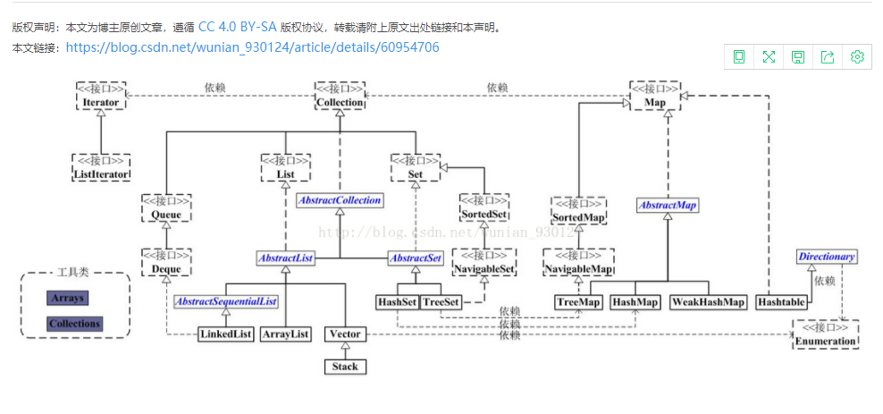

# 集合

## 1.集合框架图




## 2.Collection集合总结


## 3.Collection 框架中实现比较要实现什么接口

### 3.1.定义的比较类对象，实现comparable中的comparaTo方法

```java
@Getter
@Setter
@AllArgsConstructor
public class Teacher implements Comparable<Teacher>{
    private int age;
    private String name;
    @Override
    public int compareTo(Teacher o) {
        return this.age-o.getAge();
    }
}
```


### 3.2.自定义一个比较容器，实现comparator接口中compare方法

```java
@Slf4j
@RunWith(SpringRunner.class)
@SpringBootTest(classes = {ListOperateApplication.class})
public class ArrayListSortTest {
    /**
     * ArrayList 如何实现插入的数据按自定义的方式有序存放
     */
    @Test
    public void contextLoads() {
        Teacher s2 = new Teacher(19, "李四");
        Teacher s1 = new Teacher(18, "张三");
        Teacher s3 = new Teacher(20, "王五");
        List<Teacher> teachers = new ArrayList();
        teachers.add(s2);
        teachers.add(s3);
        teachers.add(s1);
        Collections.sort(teachers);
        log.info("老师:{}", JSON.toJSONString(teachers));

        Student s5 = new Student(19, "李四");
        Student s4 = new Student(18, "张三");
        Student s6 = new Student(20, "王五");
        List<Student> students = new ArrayList();
        students.add(s5);
        students.add(s4);
        students.add(s6);
        Collections.sort(students, Comparator.comparingInt(Student::getAge));
        log.info("学生:{}", JSON.toJSONString(students));
    }
}
```

## 4.ArrayList 和 和 Vector 的区别

### 4.1同步性

Vector 是线程安全的,也就是说是它的方法之间是线程同步的

ArrayList 是线程序不安全的，它的方法之间是线程不同步的

### 4.2数据增长

 Vector 增长原来的一倍，ArrayList 增加原来的 0.5 倍

## 5.HashMap 和 和 Hashtable 的区别

### 5.1同步性

HashMap采用异步处理方式，性能较高，但是属于非线程安全。允许设置 null

Hashtable:采用同步处理方式，性能较低，但是属于非线程安全。允许设置 null。

## 6.List 和 和 Map 区别

List是单列数据的集合，有顺序，并且允许重复

Map是没有顺序的，其键是不能重复的，它的值是可以有重复的